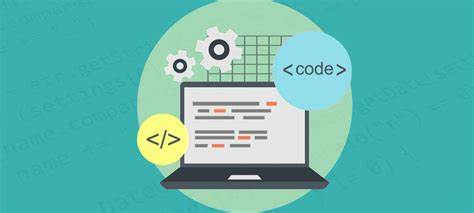

# Following Coding Standards

## What are coding standards?

Coding standards are rules that developers should follow when coding. They are coding guidelines or guides to programming styles that help to keep code organized and neat so it is readable. For example, a lot of times, you can see in code that people put a new line, or empty space between different blocks of code. This is done so code isn't clumped together and to also make code more readable. Another example could be when using if-else statements; after the if statement, you may find that some developers write the else statement on a new line rather than after the bracket closing the if statement. Maybe it's done not for the sake of making the code readable, but maybe to make the code look a little nicer.

## Why are they important?

As mentioned when defining what coding standards were, they are important for reasons such as making code readable and organized, and improving the general quality of code that is produced. By making your code organized and readable, it not only will make your life easier, but also for other developers who might also look at your code. Coding standards also help with teaching developers how to properly format and structure code. 

## My experience with coding standards

Some of the first things I learned for coding standards is how to structure code. For example, after declaring any variables in my code, I was taught to make a space between my variables and other statements or lines of code that I write after. This was to help me keep my code organized. I also remember learning when using any sort of mathematics statements in my code, for instance, "2 + 2", I was told that it would be easier to put a space between the numbers or variables and the operation sign. Doing this helped to make my code much more readable and I have always done it since. 

Recently, we started using ESlint in VSCode in my ICS 314 class, which helps us to follow certain guidelines when writing code. While it can be annoying and painful to see ESlint errors on small formatting issues, such as having a two space indent in function blocks, I believe it is helpful because it teaches me more about what guidelines I should follow when coding. ESlint has taught me a lot of new coding standards that I should follow in the future. It has also really taught me how much more strict coding standards can be, but I think it will all be very helpful in the future when I make my way into the workforce.
