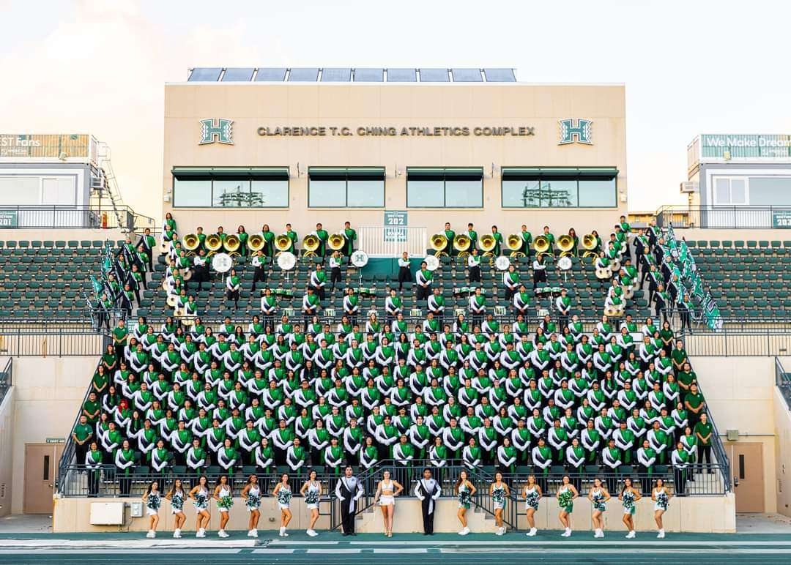

Music has played a huge role in my life. From starting off learning piano at the age of 7 years old, to now being a member
of the biggest music organization at the university. Being in the Rainbow Warrior Marching Band allows me to continue my passion for music.
It has also allowed me to meet and network with other people who also share the same passion as I do.

The University of Hawaii Rainbow Warrior Marching Band is well known across campus, as well as across the island. The band can be seen at sporting events, such as
football games, basketball games, and volleyball games. This group consists of over 250+ members that come from different states and different countries. It also 
consists of students ranging from many different majors, whether they are music majors or not.

My job as a member of the band is to participate and play at games and/or any events/gigs. As a returning member, I also must make sure I set a good example for newer members and make them feel welcome into the group. Especially if new members are new incoming students, I need to make sure I do my part and help them ease into a new chapter in their life.

Throughout my time in this group, I have learned a lot about working in a much larger group/organization. It has helped me to improve my social skills and better communicate with other people. Not only that, but it has also helped me to learn about having pride in things.

Below are playlists of shows/performances that I have been a part of:

<a href="https://youtube.com/playlist?list=PLzggQyD7SnE2QFrjktKHPRveFILnY0yAO&si=XlEDooacpNFBYlWb">UH Marching Band 2024</a>

<a href="https://youtube.com/playlist?list=PLzggQyD7SnE3MdKq6f8h3F60gw4-UVpjv&si=MC-Dl1PFyCFTVPu1">UH Marching Band 2023</a>

<a href="https://youtube.com/playlist?list=PLzggQyD7SnE21I7JNV3PXJXJdkv9qUQ5v&si=_EnVNk7F1pfQerHE">UH Marching Band 2022</a>
