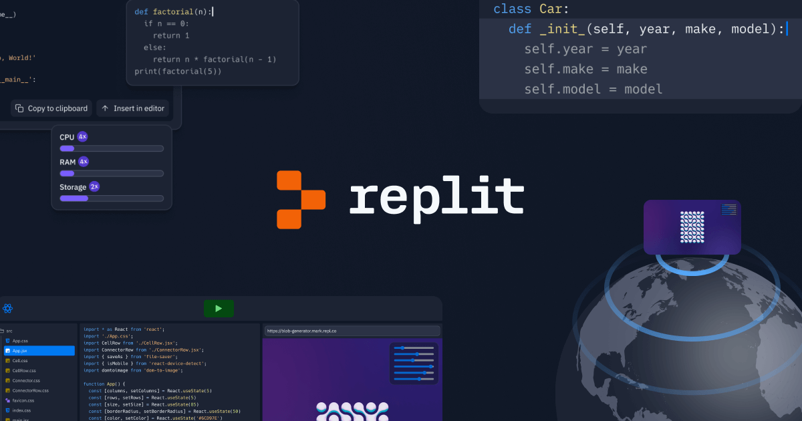

  

This was one of the first website projects that I did in my first coding class in high school. For this project, we were told to create a made up website for a shop. This meant we would need to create a made up brand or shop name, and a website that would go with the made-up shop. For our website, we were required to have multiple html pages with working links that would lead to the other pages or the home page.

This project was a solo project, meaning everyone was working on their own to create a website. This meant I had every role possible for this project. From creating a brand name, to coding the website, etc.

What I learned from this project is how websites are made. I think it's great to get a feel of what it's like to make something that other people could potentially see online. This project served as a great step towards software engineering.
