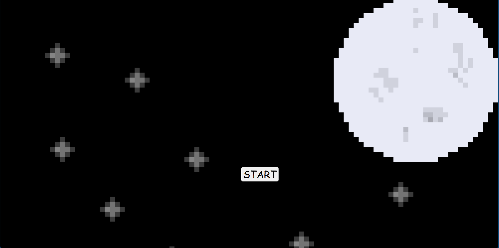

This game does not have a name. 

The general idea of the game is to travel through space without dying. There are multiple stages, each with
its own obstacle. For example, stage one requires the player to traverse through space while avoiding colliding
with asteroids for a certain amount of time. 

This project served as a 'final project' for the class. For months, students had the opportunity to work on their game during 
class time. This project demonstrated different methods used in development. For instance, students demonstrated how to input sound 
into their projects, much like how they do in video games.
